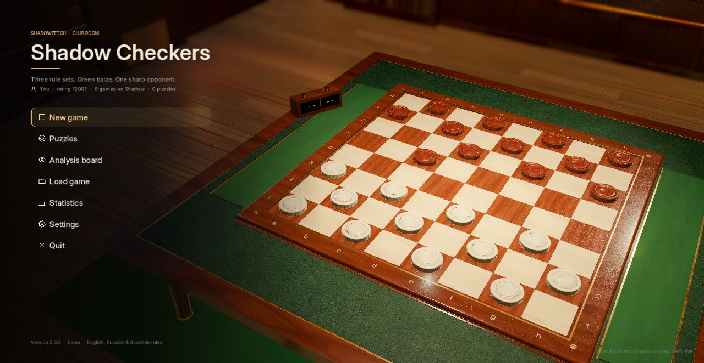
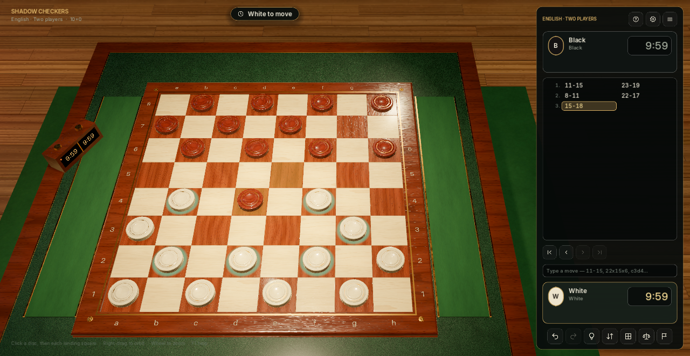
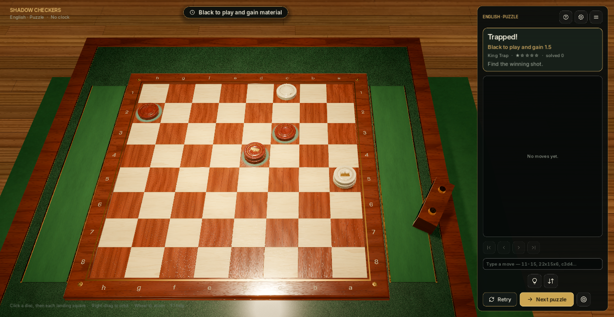
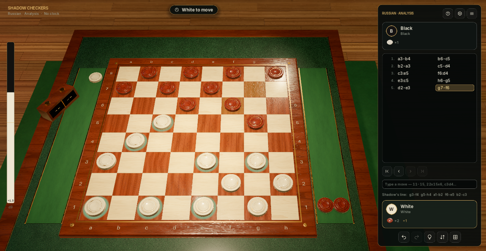
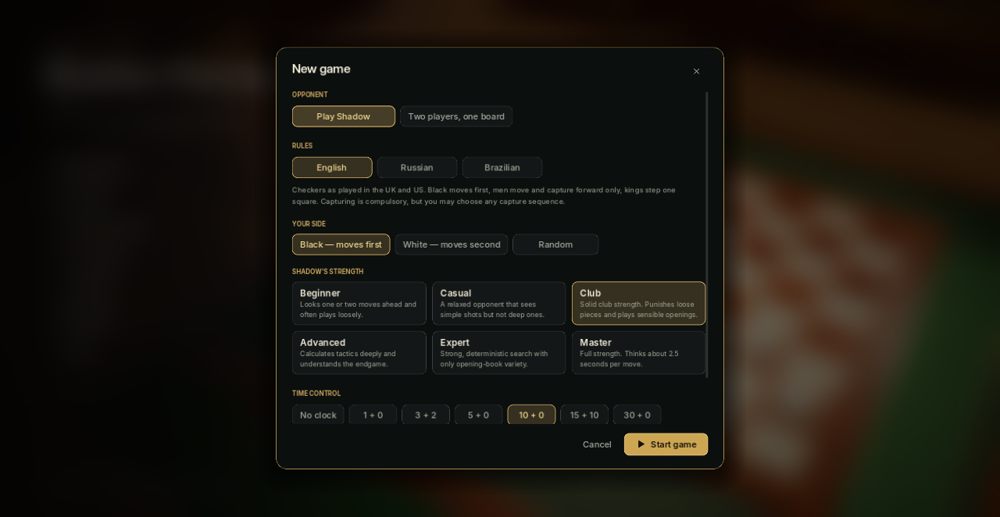

# Shadow Checkers

A flagship 3D draughts game for Linux with three rule sets — **English/American**, **Russian**, and **Brazilian** — a threaded engine with six strengths, verified tactics puzzles, and analysis, set in a lamp-lit club room. Built with Godot 4.7.

**Version 2.0.0** · Linux x86_64 · MIT





## Features

**Play**
- **Three variants**: English draughts (short kings, free choice of capture), Russian shashki (flying kings, men capture backwards, crown mid-capture and keep jumping), and Brazilian draughts (international rules on 8×8, maximum-capture rule). Full rules are in the in-game help.
- **Shadow**, six levels from Beginner to Master, on a worker thread so the board never freezes, with an English opening book. See [docs/AI.md](docs/AI.md).
- **Two players** on one board and an **analysis board** with a live evaluation bar and Shadow's best line.
- Time controls from 1+0 to 30+0 with increments and a working tournament clock on the table.
- Draw offers, resignations, rematch, and swap sides.

**Multi-jumps done right**
- Click a disc and then each landing square — or drag it hop by hop. Every hop animates as you go; jumped discs stay ghosted until the move is complete, exactly as the Turkish-strike rule requires.
- Forced sequences finish themselves (optional); Esc takes back an unfinished sequence.
- Discs that can move are ringed; compulsory captures are announced.
- Type moves in PDN (`11-15`, `22x15x6`) or squares (`c3d4`).

**Learn and review**
- **33 puzzles** — two-for-ones, breakthroughs, king traps, crowning races, and flying-king shots across all three variants (23 English, 5 Russian, 5 Brazilian). Each has a unique winning first move proven against every defence; the defender always resists as long as possible.
- **Hints** with an arrow through every landing square.
- **Review** any game move by move; evaluation and Shadow's line follow along.
- **PDN** import/export with standard FEN, numeric notation for English and algebraic for the flying-king variants; optional square numbers 1–32 on the board.
- **Statistics**: rating against Shadow and a record per variant and level.

**Feel**
- Blender-built fluted discs with a gold coronet on kings; crowning drops a second disc onto the man.
- Four board themes (Club Room, Red & Black, Slate & Stone, Marble Hall) and four disc sets that switch live.
- Captured discs land in felt trays; eased hops, contact shadows, frosted-glass dialogs.
- Original synthesised audio: disc-on-wood clacks, stacking chimes, and a slow swing ballad.
- Autosave with **Continue**, instant settings, UI scaling, reduce-motion, high-contrast marks.







## Install and run

**Download:** grab `shadow-checkers-2.0.0-linux-x86_64` from the [latest release](https://github.com/Shadowfetchapps/shadow-checkers/releases/latest), then `chmod +x` it and run it. It is a single self-contained binary.

**Build from source:**

```bash
./tools/export_linux.sh     # builds export/linux/shadow-checkers.x86_64
./tools/install_linux.sh    # installs to ~/.local/bin and adds the app launcher
shadow-checkers
```

`./tools/install_linux.sh --uninstall` removes the binary, launcher, and icons and keeps your saves. Godot 4.7.2 export templates must be installed under `~/.local/share/godot/export_templates/4.7.2.stable/`.

From source: `godot --path .`

## Controls

| Input | Action |
|---|---|
| Left click / drag | Select a disc, then each landing square |
| Esc or X | Take back an unfinished multi-jump (otherwise Esc pauses) |
| Right drag · middle drag · wheel | Orbit · pan · zoom |
| Q / E, + / − | Orbit and zoom from the keyboard |
| C · T · F | Reset camera · top-down view · flip board |
| H | Hint |
| Ctrl+Z · Ctrl+Y | Take back · replay |
| ← → · Home End | Step through the game |
| F1 · F11 | Help · fullscreen |

## Files

- Settings: `~/.config/shadow-checkers/settings.json`
- Saves, autosave, profile: `~/.local/share/shadow-checkers/`

1.x settings and saves (including per-hop move lists) are migrated automatically.

## Development

```bash
./tools/run_tests.sh                                              # all headless suites
godot --headless --path . --script res://tools/check_scripts.gd   # parse-check every script
./tools/capture_screenshots.sh                                    # regenerate docs/screenshots
```

The suites cover all three variants (English perft to depth 8, flying kings, Turkish strike, majority capture, mid-capture crowning), notation and PDN, Shadow's behaviour and threading, every puzzle and book line, settings and save migration, and an end-to-end drive of the controller entering a multi-jump hop by hop.

## Documentation

- [Architecture](docs/ARCHITECTURE.md) — rules engine, controller, save format
- [Shadow, the engine](docs/AI.md)
- [Presentation](docs/PRESENTATION.md)
- [Assets](docs/ASSETS.md)
- [Changelog](CHANGELOG.md)

Sibling project: [Shadow Chess 3D](https://github.com/Shadowfetchapps/shadow-chess-3d).
